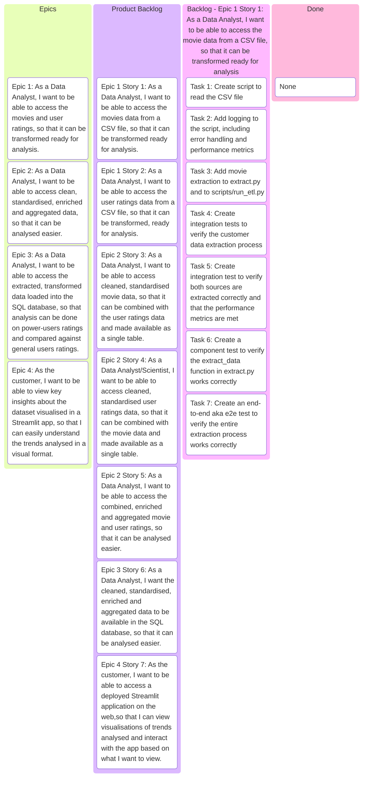

# Letterboxd Rating Analysis ETL Project

This repository contains an end-to-end ETL project that aims to extract datasets containing user ratings from Letterboxd users with the most ratings and data pertaining to the movies they have rated, as well as produce insights and visualisations of this data through Streamlit.

## PROJECT REQUIREMENTS

I want to build a robust ETL pipeline to integrate Letterboxd movie and user ratings data from a SQL database. The pipeline must clean and standardise the data and remove invalid or incomplete records, retaining only movies which have ratings or calculating the average rating for any duplicate movies with differing ratings.  Additionally, it should enrich the dataset by calculating average rating per user, average rating of each film across the userbase subsection I am studying compared to its average rating across all users. This is so that I can track trends in movie ratings across attributes such as runtime, language and genre, and identify any trends in how "power-users" rate films compared to the general userbase, as well as identify subgroups in these users with similar taste in films to potentially generate recommendations based on films the user already appreciates. These insights will be visualised in an interactive Streamlit application. The final dataset must be stored in SQL and be able to be updated regularly for accurate analysis.

---
---

## PROJECT REQUIREMENTS AS AN EPIC

```text
As THE CUSTOMER,
I want a robust ETL pipeline that integrates, cleans, standardises, and enriches Letterboxd user rating and movie data from SQL sources, retaining only movies with rating data,
So that trends in average ratings based on genre, language and runtime can be identified and compared against those same trends in "power-users" i.e. movie buffs, using an up-to-date dataset stored in SQL for accurate analysis.
```

---
---

## EPIC 1

```text
As a Data Analyst,
I want to be able to access the movies and user ratings,
So that it can be transformed ready for analysis
```

---
---

## EPIC 2

```text
As a Data Analyst,
I want to be able to access clean, standardised, enriched and aggregated data,
So that it can be analysed easier
```

---
---

## EPIC 3

```text
As a Data Analyst,
I want to be able to access the extracted, transformed data loaded into the SQL database,
So that analysis can be done on power-users ratings and compared against general users ratings.
```

---
---

## EPIC 4

```text
As THE CUSTOMER,
I want to be able to view key insights about the dataset visualised in a Streamlit app,
So that I can easily understand the trends analysed in a visual format.
```

---
---

## EPIC 1 Breakdown

```text
As a Data Analyst,
I want to be able to access the movies and user ratings,
So that it can be transformed ready for analysis
```

---

### USER STORY 1

```text
As a Data Analyst,
I want to be able to access the movies data from a CSV file,
So that it can be transformed ready for analysis
```

#### USER STORY 1 ACCEPTANCE CRITERIA

- [ ] The movies data is extracted from a CSV file
- [ ] Movies data extraction is executed in less than 2 seconds
- [ ] Extraction occurs without errors and data integrity is maintained (no missing or corrupted data)
- [ ] Successful extractions are logged
- [ ] Database connection errors are logged and handled gracefully
- [ ] Database transaction errors are logged and handled gracefully
- [ ] Movies data is stored in a Pandas DataFrame for further processing
- [ ] Tests are written to verify the movies data extraction process

---

### USER STORY 2

```text
As a Data Analyst,
I want to be able to access the user ratings data from a CSV file,
So that it can be transformed, ready for analysis
```

#### USER STORY 2 ACCEPTANCE CRITERIA

- [ ] The user ratings data is extracted from a CSV file
- [ ] User ratings data extraction is executed in less than 2 seconds
- [ ] Extraction occurs without errors and data integrity is maintained (no missing or corrupted data)
- [ ] Successful extractions are logged
- [ ] Database connection errors are logged and handled gracefully
- [ ] Database transaction errors are logged and handled gracefully
- [ ] User ratings data is stored in a Pandas DataFrame for further processing
- [ ] Tests are written to verify the user ratings data extraction process

---
---

## EPIC 2 Breakdown

```text
As a Data Analyst,
I want to be able to access clean, standardised, enriched and aggregated data,
So that it can be analysed easier
```

### USER STORY 3

```text
As a Data Analyst,
I want to be able to access cleaned, standardised movie data,
So that it can be combined with the user ratings data and made available as a single table
```

#### USER STORY 3 ACCEPTANCE CRITERIA

- [ ] Explored the dataset in Jupyter notebook to check extraction was successful
- [ ] Dropped any duplicate rows in the movies table 
- [ ] Reformatted any columns that are incorrectly formatted
- [ ] Identified any rows with missing values
- [ ] Tried to enrich rows with missing values with data from other sources where possible
- [ ] Dropped rows with missing ratings when not possible
- [ ] Rows with missing runtime, release date, language or genre can be kept
- [ ] Standardised the data so it all follows the same format
- [ ] Aggregated ratings to find the average in the case of any duplicated movies with differing ratings

---

### USER STORY 4

```text
As a Data Analyst/Scientist,
I want to be able to access cleaned, standardised user ratings data,
So that it can be combined with the movie data and made available as a single table
```

#### USER STORY 4 ACCEPTANCE CRITERIA

- [ ] Explored the dataset in Jupyter notebook to check extraction was successful
- [ ] Dropped any duplicate rows in the user ratings table 
- [ ] Reformatted any columns that are incorrectly formatted
- [ ] Identified any rows with missing values
- [ ] Limited number of records to meet dataset size requirements
- [ ] Dropped rows with missing ratings
- [ ] Dropped unnecessary _id column
- [ ] Standardised the data so it all follows the same format
- [ ] Anonymised usernames
- [ ] Aggregated average ratings of each user and stored it in a new table in the database
- [ ] Aggregated average rating of movies rated by these users, as well as ratings count for each of these  movies, and stored it in a new table in the database

---

###  USER STORY 5

```text
As a Data Analyst,
I want to be able to access the combined, enriched and aggregated movie and user ratings,
So that it can be analysed easier
```

#### USER STORY 5 ACCEPTANCE CRITERIA


- [ ] Merged the movies table with the newly created "average rating of movie by our power-users" table

---
---

## EPIC 3 Breakdown

```text
As a Data Analyst,
I want to be able to access the extracted, transformed data loaded into the SQL database,
So that analysis can be done on power-users ratings and compared against general users ratings.
```

### USER STORY 6

```text
As a Data Analyst,
I want the cleaned, standardised, enriched and aggregated data to be available in the SQL database,
So that it can be analysed easier.
```

#### USER STORY 6 ACCEPTANCE CRITERIA

- [ ] Loaded the tables into the SQL database
- [ ] Verified record count is correct
- [ ] Database connection errors are logged and handled gracefully
- [ ] Database transaction errors are logged and handled gracefully
  
---
---

## EPIC 4 Breakdown

```text
As THE CUSTOMER,
I want to be able to view key insights about the dataset visualised in a Streamlit app,
So that I can easily understand the trends analysed in a visual format.
```

### USER STORY 7

```text
As THE CUSTOMER,
I want to be able to access a deployed Streamlit application on the web,
So that I can view visualisations of trends analysed and interact with the app based on what I want to view.
```

#### USER STORY 7 ACCEPTANCE CRITERIA

- [ ] App created with Streamlit
- [ ] Visualisation of rating trends across runtime created
- [ ] Visualisation of rating trends across genre created
- [ ] Visualisation of rating trends across language created
- [ ] Visualisation of top rated films with general users vs power-users runtime created
- [ ] Visualisation of most differently rated films with general users vs power-users runtime created
- [ ] Visualisation of subgroups within power-users created
- [ ] Visualisations are interactive (users can change parameters/size of data viewed)
- [ ] General layout of Streamlit app is formed to create an easy to navigate and visually appealing website
- [ ] Streamlit app is deployed

---
---

## Definition of Done

- [ ] All subtasks are completed
- [ ] All tests are passing
- [ ] Code coverage is at least 80%
- [ ] Code is linted and follows style guidelines
- [ ] All performance metrics are met
- [ ] Code is reviewed and approved by at least one other team member
- [ ] Documentation is updated
- [ ] Code is merged into the main branch
- [ ] Streamlit application is deployed and available to users

---
---

## Project Kanban Board

### Data Extraction

> You may need to install the VSCode Mermaid Preview Extension to view this diagram



---
